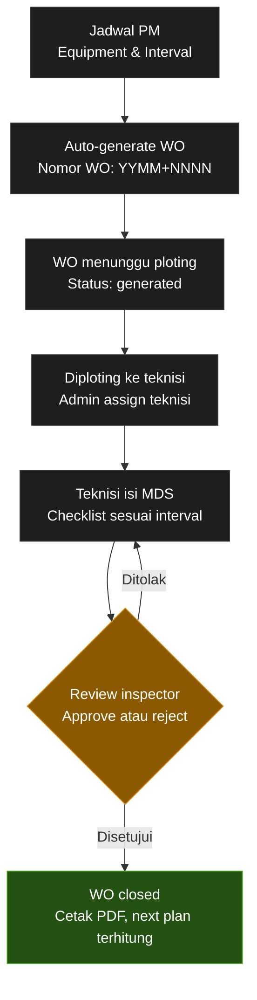

# PRD — Modul Preventive Maintenance (PM)
### Maintenance Control System (MCS)

| | |
|---|---|
| **Versi** | 1.0 |
| **Tanggal** | 27 Agustus 2026 |
| **Modul terkait** | Preventive Maintenance, Daftar Equipment, Approval Checklist, Work Order, Jadwal & Teknisi, Broadcast Notifikasi |
| **Status dokumen** | Draft untuk direview tim engineering |

---

## 1. Latar Belakang

Saat ini proses PM di MCS berjalan dengan pola berikut:

- Jadwal PM per equipment diinput manual (equipment, frekuensi, tanggal ploting, teknisi) melalui form "Rencana Jadwal Preventif".
- Tracking plan/realisasi masih dibantu spreadsheet terpisah (No Inventory, Interval, Plan Start, Next Insp, No WO, Status, Inspector).
- Checklist kerja teknisi berupa **MD Sheet (MDS)** yang sudah digital di dalam sistem: saat teknisi membuka WO yang telah diploting ke mereka, task/checklist MDS langsung muncul untuk diisi. Isi MDS ini berbeda-beda tergantung jenis equipment dan interval perawatan (bulanan, 3 bulanan, tahunan, dst), namun proses pengisiannya sepenuhnya di dalam sistem, bukan form kertas.
- Penomoran Work Order (WO) dan proses approval belum terstandarisasi di sistem.

**Masalah utama yang ingin diselesaikan:**

1. Tidak ada mekanisme otomatis yang men-generate nomor WO harian sesuai jadwal masing-masing equipment.
2. MDS masih belum terhubung langsung ke WO sebagai template digital sesuai interval.
3. Proses ploting teknisi, pengisian checklist, dan approval belum satu alur yang terintegrasi dan terlacak (auditable).
4. WO yang sudah "selesai dikerjakan" belum tentu valid — perlu approval inspector sebelum benar-benar closed dan bisa dicetak sebagai dokumen resmi.

## 2. Tujuan

1. Sistem **otomatis men-generate nomor WO** setiap hari untuk seluruh equipment yang jatuh tempo PM sesuai jadwalnya masing-masing.
2. Setiap equipment memiliki **template MDS digital** yang terhubung ke kombinasi equipment/kategori + interval, sehingga isi checklist yang muncul di WO otomatis sesuai kebutuhan interval tersebut.
3. Admin dapat **ploting teknisi** ke WO yang tergenerate melalui satu layar kerja.
4. Teknisi mengisi MDS langsung di WO, submit, lalu WO masuk **antrean approval inspector**.
5. WO baru berstatus **closed** setelah disetujui inspector, dan hanya WO closed yang bisa **dicetak PDF**.
6. Next Plan (jadwal PM berikutnya) terhitung otomatis begitu WO ditutup, sehingga siklus berjalan tanpa input ulang manual.

## 3. Ruang Lingkup

**Termasuk (in-scope):**
- Master jadwal PM per equipment (interval, plan start, next plan).
- Master template MDS (checklist) per kategori equipment & interval.
- Engine auto-generate nomor WO harian.
- Layar ploting/penugasan WO ke teknisi.
- Form pengisian MDS oleh teknisi (web, mobile-friendly).
- Alur approval oleh inspector (approve/reject).
- Export PDF WO yang sudah closed.
- Notifikasi terkait WO baru, submit, reject, approval, dan overdue.
- Dashboard monitoring status PM.

**Tidak termasuk (out-of-scope) — versi ini:**
- Corrective maintenance / WO non-PM (breakdown).
- Integrasi stok material otomatis ke WO PM (bisa jadi fase lanjutan).
- Modul biaya/costing maintenance.

## 4. Definisi Istilah

| Istilah | Penjelasan |
|---|---|
| **Equipment** | Aset/unit yang dirawat, mengacu ke Daftar Equipment (No Inventory sebagai identitas unik). |
| **Interval** | Frekuensi PM per equipment: Monthly, 2M, 3M, 6M, Annual, dst. |
| **Plan Start** | Tanggal PM pertama/aktif untuk suatu jadwal. |
| **Next Plan (Next Insp)** | Tanggal jatuh tempo PM berikutnya, dihitung dari interval. |
| **MDS (MD Sheet)** | Checklist/form kerja teknisi berisi aktivitas & hasil pemeriksaan (Pass/Failed, nilai ukur). |
| **Template MDS** | Master checklist yang didefinisikan per kategori equipment + interval (isi bisa beda tiap interval). |
| **Work Order (WO)** | Instance tugas PM yang tergenerate dari jadwal, memiliki nomor unik dan siklus status. |
| **Ploting** | Proses admin menugaskan WO ke teknisi tertentu. |
| **Inspector** | Pengguna yang memvalidasi hasil pengisian MDS sebelum WO dinyatakan closed. |

## 5. Alur Proses Bisnis End-to-End

1. **Jadwal PM (Setup jadwal)** — Admin mendaftarkan equipment ke jadwal PM: pilih equipment, interval, plan start awal, dan (opsional) template MDS yang berlaku.
2. **Auto-generate WO** — Setiap hari, sistem (scheduler job) memeriksa seluruh jadwal PM. Equipment yang plan start/next plan-nya jatuh tempo (atau dalam window H-x hari) akan otomatis mendapat **nomor WO baru** (format YYMM+NNNN), dengan MDS template ter-snapshot ke WO tersebut.
3. **WO menunggu ploting** — Status awal WO adalah **Generated**. Admin membuka daftar WO yang belum diploting (bisa difilter per tanggal/area/equipment).
4. **Diploting ke teknisi** — Admin menugaskan satu atau beberapa teknisi per WO. Status berubah menjadi **Diploting**.
5. **Teknisi isi MDS (Eksekusi lapangan)** — Teknisi login, melihat daftar WO miliknya (bisa scan QR code equipment untuk buka WO terkait), mengerjakan pekerjaan fisik, lalu mengisi form MDS digital (checklist sesuai interval), melampirkan foto/catatan bila perlu, lalu **submit**. Status menjadi **Menunggu Approval**.
6. **Review inspector (Approval)** — Inspector meninjau hasil isian MDS. Jika ditemukan masalah, inspector akan me-**reject (Ditolak)** dengan catatan, dan status kembali ke teknisi untuk direvisi (kembali ke poin 5). Jika sesuai, inspector akan me-**approve (Disetujui)**.
7. **WO closed** — Setelah approve, status menjadi **Closed**. Sistem otomatis menghitung **Next Plan** berikutnya (Plan Start/tanggal approve + interval) dan menyiapkan siklus generate WO berikutnya.
8. **Cetak PDF** — WO yang berstatus closed dapat dicetak sebagai dokumen resmi (format mengikuti layout MD Sheet: header equipment, aktivitas per section, hasil Pass/Failed, nomor WO, tanda tangan teknisi/inspector, tanggal).
9. **Monitoring** — Dashboard menampilkan WO yang overdue, menunggu ploting, menunggu approval, dan riwayat per equipment.

## 6. Model Data Utama

### 6.1 Equipment Master *(sudah ada — Daftar Equipment)*
ID Sistem, Nama Equipment, Area, Kategori, No Inventory, Manufacture/Vendor, Type, Requirements, QR Code.

### 6.2 PM Schedule
| Field | Keterangan |
|---|---|
| Equipment (FK) | Relasi ke Equipment Master |
| Interval | Monthly / 2M / 3M / 6M / Annual, dll |
| Template MDS aktif (FK) | Template yang dipakai untuk interval ini |
| Plan Start | Tanggal mulai jadwal |
| Next Plan | Dihitung otomatis (Plan Start/last closed + interval) |
| Teknisi default (opsional) | Bisa dikosongkan, diisi saat ploting |
| Status jadwal | Aktif / Nonaktif (equipment retired) |

### 6.3 MDS Template (Header)
Kategori Equipment/Tipe, Interval berlaku, Nomor Form (mis. GMF/F-003.R2), Revisi, Reference/Periode.

### 6.4 MDS Template Item (Detail)
Per section: nomor urut, judul aktivitas (mis. "General check"), daftar sub-aktivitas/deskripsi (mis. "Ukur water temperature in-out"), field input opsional (angka + satuan: °C, psi, dB, Volt R/S/T), dan **satu hasil Pass/Failed per section** — mengikuti pola pada contoh MD Sheet (General check, Panel elektrikal, Instalasi plumbing, Coil condensor, Heat exchanger, Annual maintenance).

### 6.5 Work Order (Header)
| Field | Keterangan |
|---|---|
| No WO | 8 digit, format `YYMM` + `NNNN` (lihat bagian 7) |
| Equipment (FK) | |
| Template MDS terpakai (snapshot) | Agar histori tidak berubah jika template direvisi kemudian |
| Plan Start / Next Plan | Tanggal jatuh tempo WO ini |
| Teknisi ditugaskan | Satu atau lebih |
| Inspector | Diisi saat submit/approval |
| Status | Generated → Diploting → Menunggu Approval → Revisi/Closed (lihat bagian 8) |
| Tanggal submit / approve / reject | Untuk audit trail |
| Catatan reject | Jika ada |

### 6.6 WO Checklist Result (Detail)
Hasil isian teknisi per item template: Pass/Failed per section, nilai pengukuran, catatan, foto (opsional).

### 6.7 Approval Log
Histori setiap aksi approve/reject: siapa, kapan, catatan — untuk audit.

## 7. Aturan Penomoran Work Order

**Format: 8 digit — `YYMM` + `NNNN`**

- `YY` `MM` — 2 digit tahun + 2 digit bulan saat WO **digenerate**.
- `NNNN` — nomor urut 4 digit, counter global per bulan tersebut, bertambah otomatis setiap kali ada WO baru dibuat (tidak reset harian, reset ke `0001` di awal bulan berikutnya). Urutan angka mengikuti urutan proses generate oleh sistem, bukan urutan tanggal Plan Start.

Contoh: `26070001` = WO pertama yang digenerate pada Juli 2026.

**Catatan risiko:** kapasitas 4 digit menampung maksimum 9.999 WO per bulan. Jika volume equipment/WO diperkirakan mendekati batas ini, perlu disepakati apakah digit diperpanjang atau counter dipecah per kategori/area (lihat bagian 14 — Open Questions).

## 8. Status Lifecycle Work Order

| Status | Pemicu | Aktor |
|---|---|---|
| **Generated** (menunggu ploting) | Auto-generate oleh sistem sesuai jadwal | Sistem |
| **Diploting** | Admin menugaskan teknisi | Admin |
| **Menunggu Approval** | Teknisi submit MDS terisi | Teknisi |
| **Revisi (Rejected)** | Inspector menolak dengan catatan | Inspector |
| **Closed** | Inspector approve | Inspector |
| **Overdue** *(flag tambahan)* | Belum closed melewati Next Plan | Sistem |

Alur reject → WO kembali ke teknisi terkait (bukan dibuat WO baru), teknisi revisi lalu submit ulang ke antrean approval.

## 9. Detail Modul & Fitur

### 9.1 Master Jadwal PM *(revamp menu "Preventive Maintenance")*
- Form setup equipment + interval + plan start + pilih template MDS.
- List semua jadwal aktif dengan kolom: Equipment, Area, Interval, Plan Start, Next Plan, Status jadwal.
- Kalender PM tetap dipertahankan sebagai visual bantu (seperti tampilan saat ini), namun datanya bersumber dari Next Plan tiap jadwal, bukan input manual per tanggal.

### 9.2 Master Template MDS *(menu baru, di bawah Manajemen)*
- CRUD template per kategori equipment + interval.
- Builder section: tambah section (judul), tambah sub-aktivitas/deskripsi, tandai apakah butuh input angka + satuan.
- Versioning: setiap perubahan template membuat versi baru; WO lama tetap memakai snapshot versi lama.

### 9.3 Engine Auto-Generate WO *(background job)*
- Berjalan harian (mis. tengah malam), memindai seluruh PM Schedule aktif.
- Generate WO untuk jadwal yang jatuh tempo dalam window konfigurasi (mis. H-7 sebelum Next Plan, agar admin punya waktu ploting).
- Mencegah duplikasi: satu jadwal hanya boleh punya satu WO aktif (belum closed) pada satu waktu.

### 9.4 Ploting Work Order *(revamp menu "Work Order")*
- List WO status **Generated**, filter per tanggal/area/equipment/kategori.
- Aksi ploting: pilih teknisi (bisa multi), simpan → status **Diploting**.
- Bisa reassign teknisi sebelum WO disubmit.

### 9.5 Form Pengisian MDS oleh Teknisi
- Sepenuhnya digital — tidak ada form/kertas terpisah. Teknisi login, buka list "WO saya" (WO yang sudah diploting ke mereka), lalu **klik WO** → task/checklist MDS langsung tampil di dalam WO tersebut, siap diisi.
- Bisa juga dibuka via scan QR code equipment (mengarah langsung ke WO yang sedang aktif untuk equipment tsb).
- Form menampilkan section demi section sesuai template, input Pass/Failed per section + field pengukuran + catatan/foto.
- Tombol submit → validasi seluruh section wajib terisi sebelum submit.

### 9.6 Approval *(revamp menu "Approval Checklist")*
- List WO berstatus **Menunggu Approval**, dikelompokkan per inspector/area.
- Inspector membuka detail isian MDS, dapat approve atau reject + catatan wajib bila reject.

### 9.7 Cetak PDF & Riwayat
- WO closed dapat diexport PDF dengan layout mengikuti format MD Sheet (header equipment, aktivitas per section, hasil, WO No, tanda tangan digital/nama teknisi & inspector, tanggal approve).
- Menu History per equipment menampilkan seluruh WO (closed & riwayat status) beserta link PDF.

### 9.8 Dashboard & Monitoring
- Ringkasan: jumlah WO menunggu ploting, sedang dikerjakan, menunggu approval, overdue.
- Grafik kepatuhan PM (on-time completion rate) per area/kategori/teknisi.

## 10. Hak Akses (Role Matrix)

| Fitur | Admin | Teknisi | Inspector | Manajemen (view) |
|---|:---:|:---:|:---:|:---:|
| Setup jadwal PM & template | CRUD | – | – | View |
| Lihat WO tergenerate | View | – | – | View |
| Ploting WO | CRUD | – | – | View |
| Isi & submit MDS | – | CRUD (miliknya) | – | View |
| Approve/reject WO | – | – | CRUD | View |
| Cetak PDF | View | View (miliknya) | View | View |
| Dashboard monitoring | View | View (miliknya) | View | View |

## 11. Notifikasi

| Event | Penerima |
|---|---|
| WO baru diploting | Teknisi terkait |
| WO disubmit, menunggu approval | Inspector terkait |
| WO direject | Teknisi terkait |
| WO disetujui/closed | Admin & teknisi terkait |
| WO belum diploting H-x sebelum Next Plan | Admin |
| WO overdue (lewat Next Plan, belum closed) | Admin & Manajemen |

## 12. Kebutuhan Non-Fungsional

- Auto-generate job harus idempotent (tidak generate WO dobel bila job dijalankan ulang).
- Seluruh perubahan status WO tercatat sebagai audit trail (siapa, kapan, aksi apa).
- Form pengisian MDS harus responsif/mobile-friendly untuk teknisi lapangan.
- Template MDS mendukung versioning agar histori WO lama tidak berubah retroaktif.
- PDF hasil cetak harus konsisten dengan format MD Sheet existing (kompatibel dengan kebutuhan dokumentasi/audit).

## 13. Rekomendasi Pengembangan Bertahap

| Fase | Cakupan |
|---|---|
| **Fase 1** | Model data PM Schedule, Template MDS builder, aturan penomoran WO |
| **Fase 2** | Engine auto-generate WO + layar ploting admin |
| **Fase 3** | Form eksekusi teknisi + alur approval inspector |
| **Fase 4** | Export PDF, dashboard monitoring, notifikasi |

## 14. Asumsi & Pertanyaan Terbuka

1. **Perhitungan Next Plan**: dihitung dari Plan Start awal (jadwal tetap, tidak bergeser) atau dari tanggal aktual WO closed (jadwal mengikuti realisasi)? — perlu keputusan bisnis karena memengaruhi drift jadwal jangka panjang.
2. **Window generate WO**: berapa hari sebelum Next Plan sebaiknya WO digenerate agar admin sempat ploting (mis. H-7)?
3. **Multi-teknisi per WO**: apakah satu WO bisa dikerjakan >1 teknisi sekaligus, atau harus dipecah per teknisi?
4. **Approval berjenjang**: apakah cukup 1 inspector, atau perlu multi-level approval untuk kategori equipment tertentu?
5. **Kapasitas nomor urut**: perlu konfirmasi proyeksi jumlah WO/bulan untuk memastikan 4 digit (`NNNN`) mencukupi.
6. **Equipment non-aktif**: bagaimana perlakuan jadwal PM saat equipment di-retire/dihapus dari Daftar Equipment — jadwal otomatis nonaktif?

---

*Dokumen ini merujuk pada tampilan existing: Preventive Maintenance Planning, Daftar Equipment, tracking spreadsheet PM, dan format MD Sheet (Form No: GMF/F-003.R2) yang menjadi acuan struktur template MDS.*
